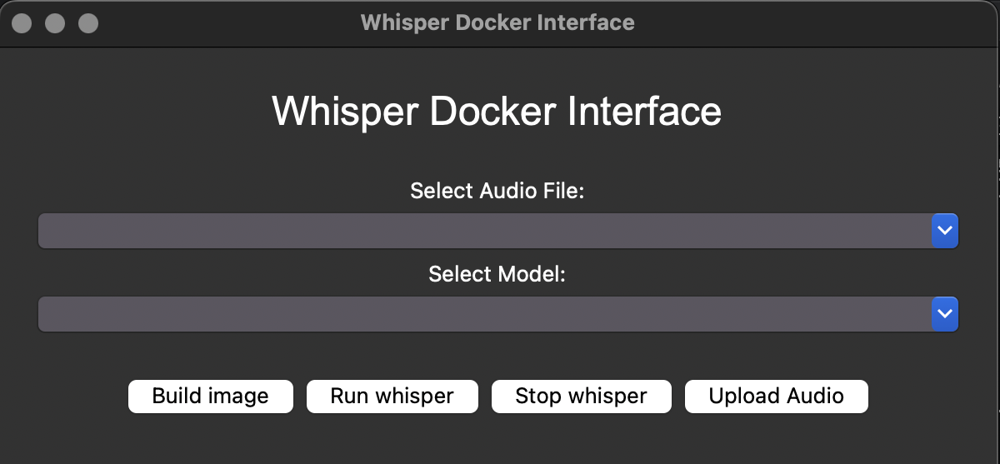

# Openai-Whisper Docker

## Description
語音轉文字，使用 docker 來跑 openai-whisper，目的是在使用的過程中不要使用到網路。


## 前置作業
1. 下載 [docker desktop](https://www.docker.com/products/docker-desktop/) 跟 [git](https://git-scm.com/downloads)
2. 打開終端機（windows 是 cmd 或 powershell）。
3. 下載此資料夾，在終端機輸入:
    ```shellscript=
    $ cd ~
    $ cd Desktop/
    $ git clone https://github.com/spockwall/whisper-docker
    ```
4. 進入資料夾 whisper-docker，並手動建立3個新資料夾：/audios, /models, /outputs
    ```
    $ cd whisper-docker/
    $ mkdir audios models outputs
    ```
5. 以上前置作業完成。注意在使用 docker 來 build 映像檔，或是第一次下載使用 model的時候，需要網路，不過一旦下載過就不需要網路了，model 的有無可以在資料夾 /models 查看。如果想要切斷網路，可以將 docker-compose.yml 的最後一行 false 改成 true，或是直接開飛航模式。

## 使用方法
1. 進入 /whisper-docker 資料夾，在終端機輸入：
    ```shellscript=
        $ cd ~
        $ cd Desktop/whisper-docker/
    ```
2. 將音檔拖入 /audios 資料夾，可以是 mp3, mp4, wav檔。
3. 接下來打開介面，在終端機輸入：
    ```shellscript=
        $ cd python gui.py
    ```
4. 可以看到有這個介面跑出來，底下有四個按鈕，如果非第一次使用直接跳到第 6 步
   
5. Build 映像檔，按最左下角的 "Build image" 按鈕，耐心等待至到完成的訊息跳出來。
6. 選擇要轉換的音檔跟欲使用的 model，並按下 "Run whisper"按鈕，會有執行中的訊息跳出，耐心等待至到完成的訊息跳出來
7. 全部轉換完之後或中途不想轉換了，可以按下 "Stop  whisper"。
8. 音檔可以按 "Upload audio" 來上傳，也可以直接把音檔拖入資料夾 /audios。

## 注意事項
1. 不要隨意更改資料夾的相對位置。
2. 這個介面不好按，要有耐心。
